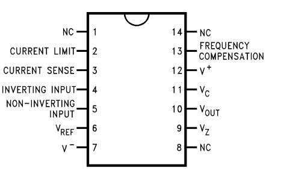
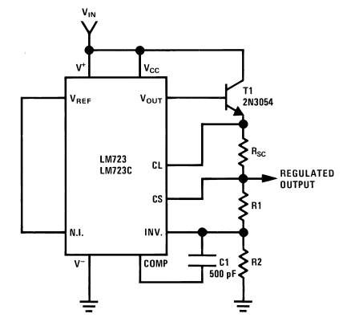

# LM723

To act as a general-purpose, precision linear voltage-regulator controller that is used to build a regulated DC power supply with programmable output voltage, current limit, and power capability.

| Pin  | Name (datasheet) | What it’s used for (practical meaning)                       |
| ---- | ---------------- | ------------------------------------------------------------ |
| 1    | **NC**           | No internal connection (leave open)                          |
| 2    | **CURR LIM**     | Current limit control input (used with sense resistor/network to set limit) |
| 3    | **CURR SENS**    | Current sense input (measures drop across sense resistor)    |
| 4    | **IN−**          | Error amplifier inverting input (feedback/comparison node)   |
| 5    | **IN+**          | Error amplifier non-inverting input (feedback/comparison node) |
| 6    | **REF**          | Precision reference output (~7.15 V nominal)                 |
| 7    | **VCC−**         | Negative supply / ground (for single-supply use, this is 0 V) |
| 8    | **NC**           | No internal connection (leave open)                          |
| 9    | **VZ**           | Zener/reference diode node used in some configurations (often tied/used per datasheet circuits) |
| 10   | **OUTPUT**       | Regulated output sense/output node (depends on configuration; used in the standard series regulator circuits) |
| 11   | **VC**           | Collector supply for internal pass transistor / drive stage (typically tied to unregulated input) |
| 12   | **VCC+**         | Positive supply for the IC (unregulated input supply to power the chip) |
| 13   | **FREQ COMP**    | Frequency compensation (stability capacitor connection)      |
| 14   | **NC**           | No internal connection (leave open)                          |

